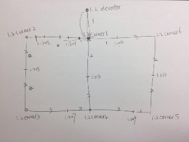
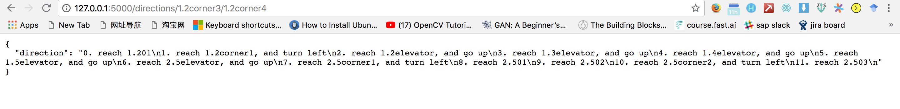

# kk-navigator-mvp

MVP/Demonstrator for the API endpoint of the navigator app

## Map Overview

The map is a simulation of an urban environment. In this case, we choose to simulate a portion of SUTD.

There are two Blocks, and each Block has 5 levels. Each level follows a simple schematic. 



### naming, the following names are correct names for start and destination

```
## elevators
1.2elevator # elevator on building 1, level 2
2.3elevator # elevator on building 2, level 3

## corners
1.2corner1  # corner 1 on building 1, level 2
2.4corner6  # corner 6 on building 2, level 6

## classrooms
## each level have same number of classrooms and their position is also the same
1.201       # classroom 1 on building 1, level 2
2.510       # classroom 10 on building 2, level 5
```

### Pathways

```
## pathway between cls rooms
there is a weight assigned to every path, weight stands for time taken choosing that path
the large the weight is, the more time takes to finish that path.
for example the path connecting 1.202 and 1.201 is 1 unit.

## pathway between each elevator on the same blk
1.2elevator connects 1.3elevator is connected(we assume 1.2 is the lowest floor)
1.3elevator connects 1.4elevator and 1.2elevator is connected.

## pathway between blks
## there is only 2 inter blk connections
1. between 1.3elevator and 2.3elevator
2. between 1.5elevator and 2.5elevator
```
## Running/Using the API



## Acknowledgements

* Using [dijkstras algorithm](https://github.com/mburst/dijkstras-algorithm) to find shortest path
